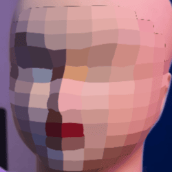

# mosaic-facefilter

real-time stylized face pixelation for streaming and recording. keeps your identity anonymous while tracking facial motion.



## why i made this

saw someone using this filter on instagram and couldn't find it anywhere, so i just built it myself. now you can use it too.

## what it does

- blocks stay stuck to your face even when you turn sideways
- instant privacy protection (covers your face from frame 1)
- runs at 60fps with GPU acceleration
- works with OBS for streaming

## requirements

- **node.js** v16 or higher ([download](https://nodejs.org))
- **npm** v7 or higher (comes with node)

check your versions:
```bash
node -v
npm -v
```

## quick start

**just want to use it?**

### mac

```bash
git clone https://github.com/yungalgo/mosaic-facefilter.git
cd mosaic-facefilter
npm install
npm start
```

### windows

```bash
git clone https://github.com/yungalgo/mosaic-facefilter.git
cd mosaic-facefilter

# install (downloads Electron binary via postinstall)
npm install --no-optional --foreground-scripts

# run
npm start
```

the app opens, asks for camera permissions, and you're done.

---

**want a standalone app you can double-click?**

build it once:

```bash
# mac - creates a .dmg installer
npm run build:mac

# windows - creates a .exe installer
npm run build:win
```

then just distribute/install the built app. no terminal needed after that.

## stack

- **electron** - desktop app framework, gives us a browser window with camera access
- **mediapipe tasks-vision** - google's face tracking library, finds 468 facial landmark points
- **webgl** - GPU shaders for the pixelation effect, renders at 60fps
- **custom UV pipeline** - unwraps your face to a flat texture, pixelates it, then wraps it back with depth testing

## tweak the settings

edit `src/renderer/app.js`:

```javascript
const TILES_U = 12;   // fewer = bigger blocks
const TILES_V = 14;
const FACE_SCALE_Y_DOWN = 1.1;  // how much to extend down (chin coverage)
```

## how it works

uses mediapipe to track 468 face points, then renders chunky pixels that follow your face in 3D. depth testing makes sure the front of your face covers the back when you turn.

two-tier detection: fast bbox pixelation kicks in immediately, then switches to high-quality mesh-based rendering once tracking locks.

## credits

thx to [@lschmelzeisen](https://github.com/lschmelzeisen) for [understanding-mediapipe-facemesh-output](https://github.com/lschmelzeisen/understanding-mediapipe-facemesh-output) — v helpful

## troubleshooting

**windows: Electron failed to install correctly**  
Delete the broken electron package and reinstall with scripts enabled:
```powershell
rmdir /s /q node_modules\electron
npm cache clean --force
npm install electron@28 --save-dev --foreground-scripts
npm install --no-optional --foreground-scripts
```

**camera not working?** check system privacy settings  
**laggy?** lower the TILES values

---

**[@yungalgorithm](https://github.com/yungalgo)** · MIT license · star if useful ⭐
